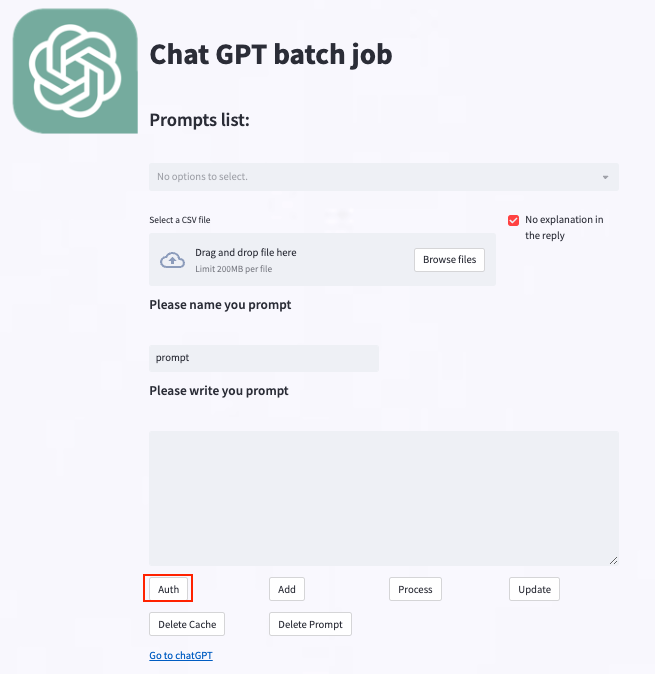
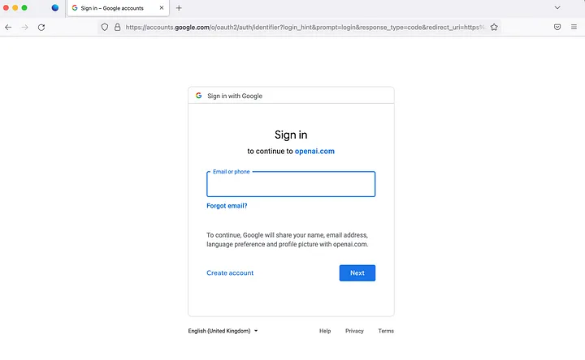

# 🦮 Welcome to ChatGPT Batch Whipper 🦮


The ChatGPT Batch Whipper is a tool designed to simplify batch jobs using ChatGPT. With this tool, you can:

* Save and reuse prompts, making it easy to apply them to multiple inputs automatically using an input CSV file.
* Ensure continuity and coherence by submitting input data for the same prompt to the same conversation.
* Resume the batch job from where you left off, even if you unintentionally stop the process, thanks to the tool's data saving feature.
* Never worry about exceeding hourly submit times, as the tool waits until it can run again.
In short, the ChatGPT Batch Whipper tool is an efficient and user-friendly way to perform batch jobs with ChatGPT. We welcome any feedback or suggestions you may have, so give it a try and see how it can improve your workflow!## Installation


## Installation

1. Clone the repo to your working directory
```bash
git clone https://github.com/CodeDiggerM/chatgpt-batch-whipper.git
```
2. install the dependcy.
```bash
pip install -r requirements.txt
```

2. Install a browser in playwright (if you haven't already).  The program will use firefox by default.

```
playwright install firefox
```

3. Go to the chatgpt-batch-whipper/

```bash
cd chatgpt-batch-whipper/
````

4. Run the main page by streamlit.
you can got to [streamlit](https://github.com/streamlit/streamlit) to check more about streamlit.

```bash
streamlit run start_whipper.py
````
5. Authenticate your openAI account
Click the **auth** button
</img>

It will open up an authentication page in the web browser you installed using playwright. Like below, authenticate with your registered account.
</img>


## Quickstart

Now run it to open the app!
```
streamlit run streamlit_app.py
```

### Single shoot mode

1. select the **Single shoot mode**.
2. Type your prompt then click submit
3. click the submit button

</img>
Here are some tips.

### Fully Automatic mode
You can apply your prompt to multiple records in the **Fully Automatic mode**.

1. Select Fully Automatic mode.
2. Select CSV file.
3. Select column you want to process.
4. Type the prompt.
5. click to Submit.
After processing. The result will appears in the **The processed result** section.
</img>

you can check the result and check the "is false" then click the **Submit** to reprocess the "failed" one.

</img>

* You can save the prompt by click **Add** button.
* You can choose the old prompt by select **prompt list**.
* You can delete the old prompt by click **Delete Prompt**.
* You can delete the saved process result by click **Delete Cached result**.
* You can update the saved process result by click **Update**.
* You can download the result file by click **Download**.
